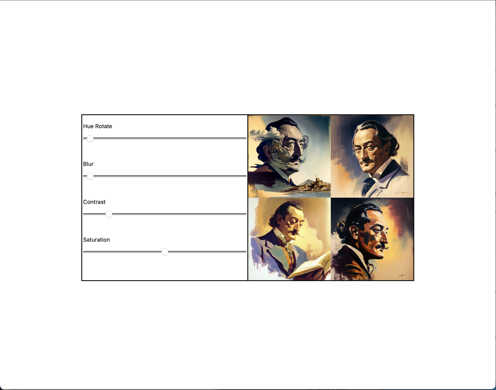
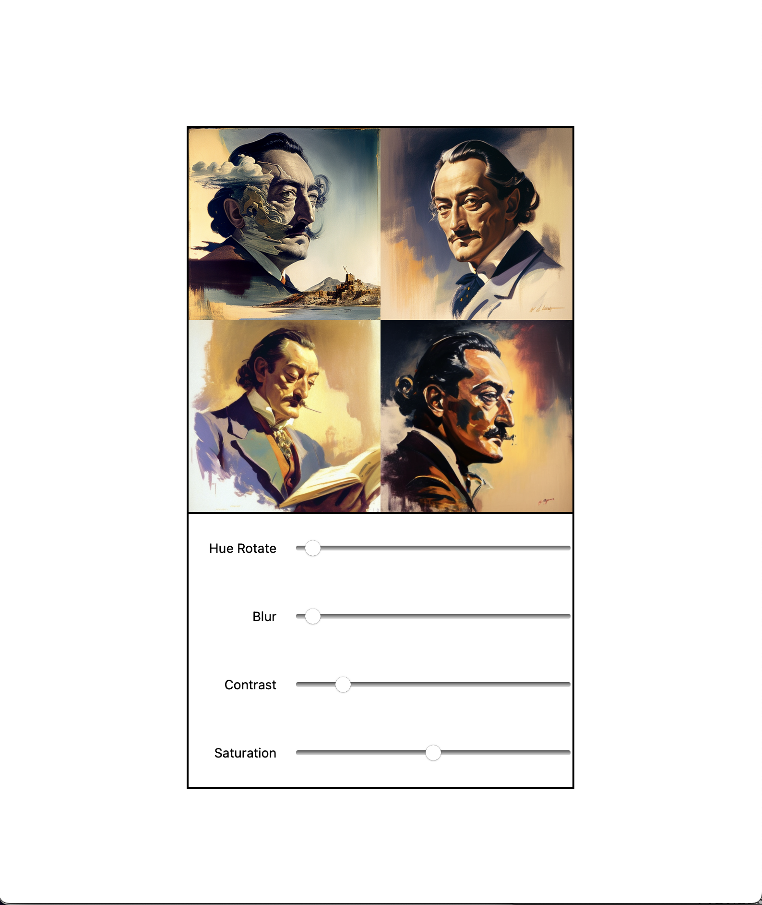
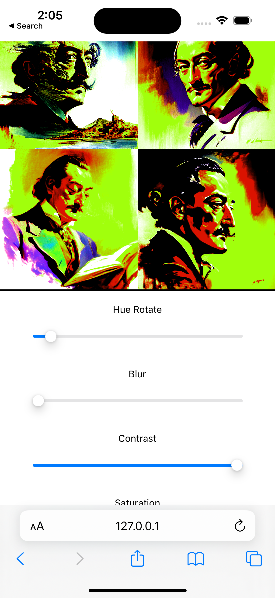

# Final Assessment Product by Vithusha Ravirajan
####Requirements outlined below

## Desktop View

## Tablet View

## Mobile View

# Final Assessment Requirements

We have a new image editing app. Your job is to style it, make it responsive and as accessible as you can. 

Start with the source files here. 

## Responsive design

You can make any changes you like to the source files. Keep in mind that changing the id names will break the functionality of the site!

The current site has no styles. We need three break points to make the site work on mobile, tablet, and desktop. 

On desktop the site should display as two boxes side by side each 400px by 400px. 

The image will be on the right and the form on the left. 

The form elements will be stacked vertically with the label above each input aligned to the right. 

See the image below. 

When the screen is 800px or smaller the the site should arrange itself vertically with the image at the top and the form below. 

The form elements should stack vertically with the label on the left of each input. The text should align to the right and the inputs should all be equal width and take up about three quarters of the space. 

See the image below: 

On mobile devices the the page should stack vertically with the image at the top and the form below. 

The form elements should display almost the full width of the screen, centered and the labels should appear above each form element with the text centered. 

See the image below: 

## Accessibility

Do your best to make this accessible as you can.

Apply semantic tags where possible. 

Use ARIA attributes where they may be needed. 

Add anyother accessibility features you think might improve the site with any time you have available. 

## Submit your work

Submit your work to gradescope when completed. 
